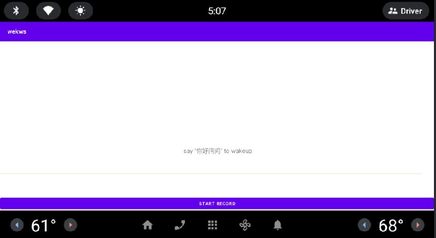

# 关键词检测 （keyword-spotting）

关键词检测（Spoken keyword spotting, KWS）是语音识别领域的一个子领域，其目的是在语音信号中检测指定词语的所有出现位置。该技术在智能设备唤醒和控制有重要作用。

本项目是基于[WeKws](https://github.com/wenet-e2e/wekws)构建的流水线（pipeline），包括数据处理，模型训练和转换等步骤，使KWS模型能够在Android设备上提供准确、稳定和快速的关键词检测服务。

## Change Log
- [2024/4/16] 添加DS_TCN(唤醒词：你好问问)的模型转换和demo-apk编译，模型来源：modelscope


## 模型训练
目前使用的是modelscope（魔搭社区）发布的开源模型，模型使用指定数据集训练完毕，不需要自己训练。

官网：[ModelScope](https://modelscope.cn/my/overview) 魔搭社区

### 模型列表

| 损失函数    | 模型名称         | 模型(Pytorch ckpt)                                           |
| ----------- | ---------------- | ------------------------------------------------------------ |
| Max-Pooling | DS_TCN(你好问问) | [DSTCN-MaxPooling, wekws训练](https://modelscope.cn/models/daydream-factory/keyword-spot-dstcn-maxpooling-wenwen/summary) |


训练计划：
- 数据集构建
- 训练（使用GPU加速） 
- *[TBD]*

## 模型推理
*[To-do]*

## 模型转换

模型转换分为两步：

- pytorch2onnx: 将训练好的pytorch模型转换为onnx模型。onnx模型是常见的中间态模型，支持转换其他平台的模型(ncnn, tensorRT等各类推理引擎模型)。
- onnx2ort: 将onnx模型转换成ort模型，用于端侧部署。

详细步骤参考“[模型转换文档](./docs/model_convert.md)”。

## Android Apk 编译

安装Android Studio，打开工程路径 `wekws/runtime/android`。

使用上一步转换得到的模型`keyword-spot-dstcn-maxpooling-wenwen.ort`，替换wekws项目中已有Hi-snips模型`wekws/runtime/android/app/src/main/assets/kws.ort`，再开始编译。

编译完成以后，使用adb工具在安卓设备上安装apk文件：
```bash
wekws\runtime\android\app\release\app-release.apk
```


## Trouble-shooting

- The default feature_dim in code is 40, if your model’s is 80, change it here `./app/src/main/cpp/wekws.cc`
```c
feature_config = std::make_shared<wenet::FeaturePipelineConfig>(40, 16000);  // 40 -> 80
```
- Windows Android Studio 上链接文件找不到，出现编译错误。解决方法：拷贝 `wekws/runtime/core`路径下的文件夹（frontend, kws, utils）到 `wekws/runtime/android/app/src/main/cpp/`
```
Cannot find source file: Frontend/http://featre_pipeline.cc
```

## 参考资料

- Github repo
    - https://github.com/wenet-e2e/wekws
    - https://github.com/chenyangMl/keyword-spot

- 技术文章
    - https://zhuanlan.zhihu.com/p/666152948